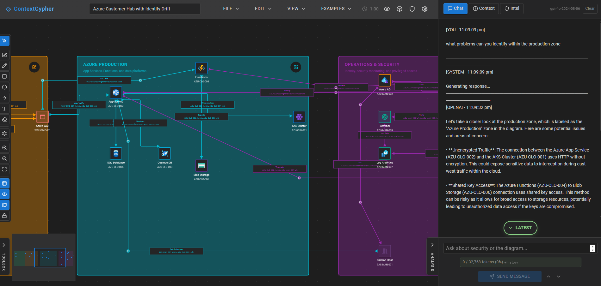
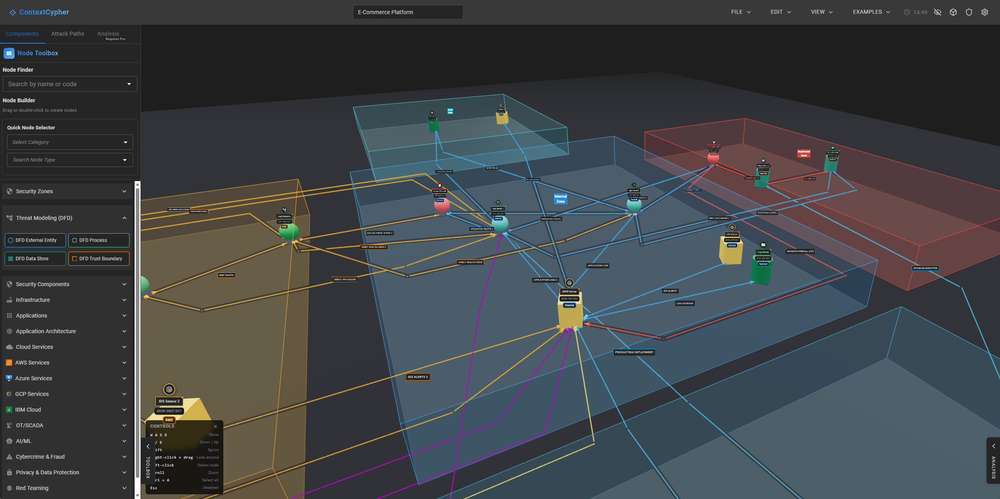
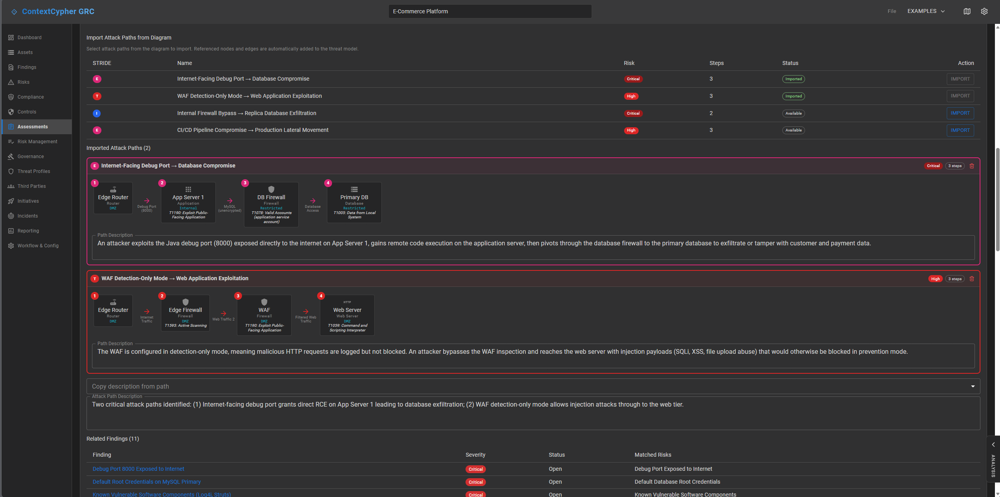
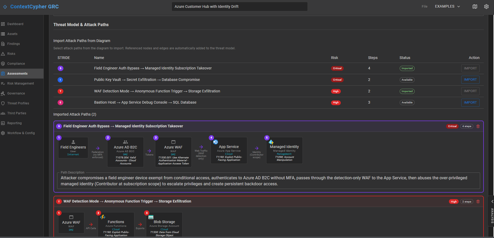

# ContextCypher

An offline-first desktop application for creating system architecture diagrams and generating AI-powered security threat analysis.

Built for security professionals, architects, and developers. Visually map out your systems and receive security insights powered by local LLMs without your data leaving your machine.



## Features

- **Offline-First** -- Operates entirely offline using local LLMs (Ollama). Your data stays on your machine.
- **AI-Powered Threat Analysis** -- Identifies threats, vulnerabilities, and risks using MITRE ATT&CK and NIST frameworks.
- **AI Diagram Generation** -- Describe your system in plain text and get a complete threat model diagram.
- **Diagram Editor** -- ReactFlow-based editor with custom nodes, security zones, and connection properties.
- **Drawing & Annotation Layer** -- Free-form drawings, text, and boundary boxes on your diagrams.
- **3D Isometric View** -- Visualize your architecture in an interactive 3D isometric perspective.
- **GRC Module** -- Integrated governance, risk, and compliance with attack path visualization and STRIDE mapping.
- **Autosave** -- Configurable autosave with modern file system integration.
- **Multiple AI Providers** -- Ollama (default, offline), OpenAI, Anthropic Claude, Google Gemini.

### 3D Isometric View



### GRC Module -- Attack Paths & Threat Modeling

<p>


</p>

## Technology Stack

- **Frontend:** React 18, TypeScript, Material-UI, ReactFlow
- **Backend:** Node.js v18, Express.js
- **AI:** Ollama (local, offline), OpenAI, Anthropic Claude, Google Gemini

## Prerequisites

- **Node.js** v18.x or later
- **npm** v10.x or later
- **Ollama** (optional) -- for local AI. Download from [ollama.com](https://ollama.com)

## Getting Started

```bash
git clone https://github.com/Threat-Vector-Security/contextcypher.git
cd contextcypher
npm install
cd server && npm install && cd ..
```

### Windows (PowerShell)

The included dev scripts are PowerShell-based:

```powershell
# Frontend work -- hot reload on port 3000, backend on port 3002
.\Development-Rebuild.ps1

# Full rebuild -- builds frontend + backend, starts both servers
.\full-rebuild.ps1
```

### All Platforms (Manual Start)

```bash
# Backend (with auto-restart)
cd server && npm run dev

# Frontend (separate terminal)
npm start

# Or both at once
npm run dev
```

- Frontend: http://localhost:3000
- Backend: http://localhost:3002

### Running Tests

```bash
npm test
npm run test:watch
```

## Architecture

```
src/                    # React frontend
├── components/         # DiagramEditor, SettingsDrawer, ThreatAnalysisPanel, etc.
├── services/           # AnalysisService, ConnectionManager, etc.
├── hooks/              # React hooks
├── types/              # TypeScript types
└── utils/              # Utilities

server/                 # Express backend
├── services/           # SimplifiedThreatAnalyzer, AIProviderManager, etc.
├── utils/              # Security, logging, model capabilities
├── config/             # Server configuration
├── routes/             # Express route handlers
└── data/               # Security knowledge base
```

The frontend handles diagramming, settings, and display. The backend handles AI provider communication, threat analysis orchestration, and MITRE ATT&CK mapping.

## Setting Up Ollama

```bash
# Install (macOS/Linux)
curl -fsSL https://ollama.com/install.sh | sh

# Pull a model
ollama pull llama3.2

# Windows: download from https://ollama.com/download
```

Open Settings in the app and select Ollama as your AI provider.

## Contributing

See [CONTRIBUTING.md](CONTRIBUTING.md) for development setup and guidelines.

## License

[Apache 2.0](LICENSE)
