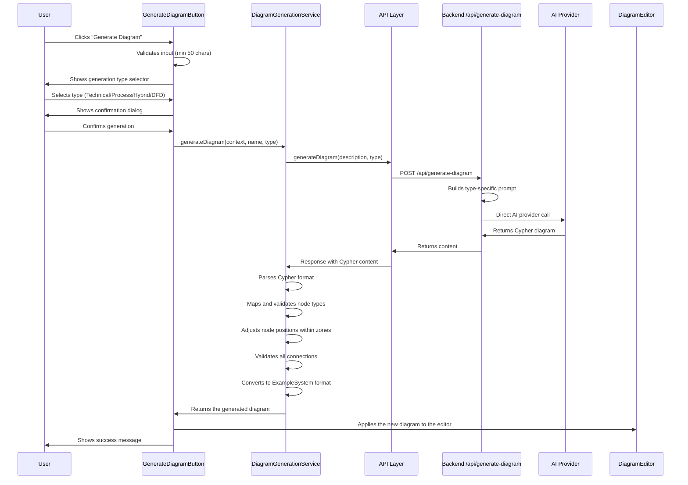

# Feature Deep Dive: AI Diagram Generation Service

This document provides a detailed look at the AI-powered diagram generation system that creates complete threat model diagrams from text descriptions. The service uses Cypher graph format for efficient token usage and supports 35 different security zones including specialized zones for red/blue/purple teams, cloud environments, and generic custom zones.

**New in 2025-07**: The service now supports three distinct generation modes (technical, process, hybrid) with dedicated backend endpoint for improved separation of concerns and reliability.

**New in 2025-09**: Added DFD (Data Flow Diagram) generation mode for traditional STRIDE threat modeling with specialized DFD components.

## 1. Overview

The AI Diagram Generation service is designed to accelerate the threat modeling process by allowing users to describe their system architecture in natural language and have the application intelligently construct a corresponding diagram. This includes creating nodes, edges, and security zones with appropriate properties and layouts. The service uses advanced architectural pattern detection, intelligent zone layouts, and sophisticated overflow handling to ensure all components are properly placed and connected.

### Token Requirements

With the Cypher format optimization, token requirements are significantly reduced:

*   **Simple systems (5-10 components):** ~2,000-4,000 tokens
*   **Medium systems (10-20 components):** ~4,000-8,000 tokens  
*   **Complex systems (20-50 components):** ~8,000-16,000 tokens
*   **Enterprise systems (50+ components):** 16,000-32,000 tokens

The service automatically handles large contexts without chunking, producing better results with fewer API calls.

## 2. Core Components

### `DiagramGenerationService.ts` (`src/services/`)

This is the main service that orchestrates the entire diagram generation process.

*   **Purpose:** To convert a user's text description into a structured `ExampleSystem` object that can be loaded into the `DiagramEditor`.
*   **Input:** A text description of the system, an optional system name, generation type (technical/process/hybrid), and the currently selected AI provider.
*   **Output:** A fully formed diagram object containing nodes, edges, security zones, and metadata.
*   **Key Features:**
    - Four generation modes: Technical (accurate representation), Process (workflow focus), Hybrid (balanced approach), DFD (traditional threat modeling)
    - Architectural pattern detection (Enterprise, DevOps, Industrial, Cloud Hybrid, Zero Trust, Security Operations)
    - Dynamic zone sizing based on component count with intelligent vertical staggering
    - Multi-level overflow handling to ensure no nodes are lost
    - Cypher format support for efficient AI token usage (80% reduction)
    - Support for 35 security zones including Generic zone for custom environments
    - Over 200 predefined node types across 10 categories plus 4 specialized DFD types
    - Intelligent zone layout with vertical positioning for guest/cloud zones
    - Dedicated `/api/generate-diagram` endpoint for clean separation from chat/analysis

### `GenerateDiagramButton.tsx` (`src/components/`)

This is the primary UI component for accessing the feature.

*   **Purpose:** Provides the user interface for triggering the generation process.
*   **Gating:** It is wrapped in the `ProFeatureGuard` component, ensuring that only users with a valid Pro or Enterprise license can access it.
*   **Workflow:** Manages the multi-step generation process, including input validation, generation type selection, user confirmation, progress tracking, and error handling.
*   **Generation Types:**
    - **Technical**: For system architecture diagrams with exact component representation
    - **Process**: For business workflows with aggressive component grouping
    - **Hybrid**: Balanced approach with smart grouping for large systems
    - **DFD**: Traditional Data Flow Diagrams for STRIDE threat modeling

## 3. Generation Process Flow

The process follows a clear sequence of steps to ensure a robust and reliable outcome:



## 4. Technical Implementation Details

The service employs several sophisticated techniques to translate unstructured text into a structured diagram.

### 4.0. Supported Security Zones

The system supports 35 distinct security zones:

**Traditional Security Zones:**
- Internet, External, DMZ, Internal, Trusted, Restricted, Critical

**Development & Operations:**
- Development, Staging, Production, OT (Operational Technology)

**Cloud & Hybrid:**
- Cloud, Hybrid, MultiCloud, Edge

**Specialized Zones:**
- Guest, Compliance, Management, ControlPlane, DataPlane, ServiceMesh
- BackOffice, Partner, ThirdParty, Quarantine, Recovery

**Security Team Zones:**
- RedTeam, BlueTeam, PurpleTeam, YellowTeam, GreenTeam, OrangeTeam, WhiteTeam

**Generic Zone:**
- Generic (white color) - for custom or specialized environments that don't fit predefined categories

### 4.1. Generation Modes

The service supports four distinct generation modes, each optimized for different use cases:

#### Technical Mode
*   **Purpose:** Accurate representation of technical architecture
*   **Characteristics:**
    - Creates every component mentioned without grouping
    - Models exactly what's described, including vulnerabilities
    - Prioritizes accuracy over readability
    - No assumptions about security controls
    - Best for detailed security analysis

#### Process Mode
*   **Purpose:** Business process and workflow diagrams
*   **Characteristics:**
    - Aggressive grouping (target 30-50 nodes max)
    - Groups similar components: "25 monitors" → "Monitors (25)"
    - Focus on process flow rather than technical details
    - Uses instanceCount for grouped quantities
    - Best for large healthcare/business workflows

#### Hybrid Mode
*   **Purpose:** Balance between accuracy and readability
*   **Characteristics:**
    - Smart grouping for 3+ similar components
    - Mandatory instanceCount for all groups
    - Never groups security devices
    - Completeness check ensures no components lost
    - Best for typical enterprise systems

#### DFD Mode (Data Flow Diagram)
*   **Purpose:** Traditional threat modeling using STRIDE methodology
*   **Characteristics:**
    - Uses only 4 specialized DFD node types:
      - `dfdActor`: External entities (users, systems, APIs, services)
      - `dfdProcess`: Processing elements that transform data
      - `dfdDataStore`: Data storage (databases, files, caches, queues)
      - `dfdTrustBoundary`: Trust boundaries between zones/privileges
    - Focuses on data flows between components
    - Emphasizes trust boundaries and privilege transitions
    - Best for STRIDE threat analysis
*   **Auto-Detection:** Triggered when user mentions "DFD", "data flow diagram", "STRIDE", "trust boundaries"

### 4.2. Grid System Architecture

The layout system uses a precise grid-based approach for professional node placement:

*   **Grid Unit:** 50px - all positions are multiples of 50 for alignment
*   **Zone Dimensions:** 650px width × dynamic height (calculated based on content)
*   **Available Columns:** 12 usable columns per zone (650px ÷ 50px = 13 units, with 1 unit for margins)
*   **Node Size:** 150px × 100px (3×2 grid units), allowing 3-4 nodes per row
*   **Grid Spacing:** 
    - Standard: 200px horizontal (4 units), 150px vertical (3 units)
    - High-connection nodes (3+ connections): 250px spacing
    - Vertical staggering: 50% of zone height for alternating nodes

### 4.2. Dynamic Zone Sizing

Zones expand dynamically to accommodate all assigned components:

```typescript
// Dynamic height calculation based on component count
const calculateZoneHeight = (zone: SecurityZone, componentCount: number): number => {
  const MIN_HEIGHT = 800;
  const NODES_PER_ROW = 3; // Conservative estimate with good spacing
  const ROWS_NEEDED = Math.ceil(componentCount / NODES_PER_ROW);
  const ROW_HEIGHT = 150; // 100px node + 50px spacing
  
  // Add extra buffer for tier separation and overflow
  const BUFFER = 300;
  const calculatedHeight = Math.max(MIN_HEIGHT, (ROWS_NEEDED * ROW_HEIGHT) + BUFFER);
  
  // Round up to nearest 100px for consistency
  return Math.ceil(calculatedHeight / 100) * 100;
};
```

### 4.3. Multi-Level Overflow Handling

The service implements a sophisticated three-tier overflow system to ensure no nodes are lost:

1. **Within-Zone Overflow:** First attempts relaxed spacing within the assigned zone
2. **Cross-Zone Overflow:** Places nodes in logically related zones based on zone relationships
3. **Overflow Zone:** Creates a dedicated overflow zone if all other options are exhausted

#### Zone Relationship Mapping
```typescript
const zoneRelationships: Record<SecurityZone, SecurityZone[]> = {
  'Internet': ['External', 'DMZ', 'Guest'],
  'External': ['DMZ', 'Internet', 'Guest'],
  'DMZ': ['External', 'Internal', 'Internet'],
  'Internal': ['DMZ', 'Trusted', 'Development'],
  'Trusted': ['Internal', 'Production', 'Critical'],
  'Restricted': ['Critical', 'Trusted', 'Production'],
  'Critical': ['Restricted', 'Trusted', 'Production'],
  'OT': ['Internal', 'Critical', 'Production'],
  'Development': ['Staging', 'Internal', 'Cloud'],
  'Staging': ['Development', 'Production', 'Cloud'],
  'Production': ['Staging', 'Internal', 'Cloud'],
  'Cloud': ['Hybrid', 'Production', 'Internal'],
  'Guest': ['External', 'Internet', 'DMZ'],
  'Compliance': ['Restricted', 'Critical', 'Management'],
  'Management': ['Internal', 'Compliance', 'Critical'],
  'RedTeam': ['BlueTeam', 'PurpleTeam', 'Management'],
  'BlueTeam': ['PurpleTeam', 'Management', 'Internal'],
  'PurpleTeam': ['RedTeam', 'BlueTeam', 'Management'],
  'Generic': ['Internal', 'External', 'DMZ'],
  // ... additional relationships for all 35 zones
};
```

### 4.4. Dynamic Node Type System

The service uses a dynamic node type system that automatically extracts valid types from the frontend TypeScript definitions:

*   **Dynamic Type Loading:** Node types are extracted from `src/types/SecurityTypes.ts` at runtime via `/server/utils/nodeTypes.js`
*   **Comprehensive Coverage:** Currently supports 249+ distinct node types across 10 categories
*   **Automatic Updates:** No manual maintenance required - new types added to SecurityTypes.ts are automatically available
*   **Type Validation:** AI prompts include the complete list of valid types to prevent invalid node creation

#### Dynamic Type Extraction Function

```javascript
// server/utils/nodeTypes.js
function getValidNodeTypes() {
  // Extracts all node types from SecurityTypes.ts using regex patterns
  // Covers: InfrastructureNodeType, SecurityControlNodeType, ApplicationNodeType, 
  //         CloudNodeType, OTNodeType, AINodeType, CybercrimeNodeType, 
  //         PrivacyNodeType, AppSecNodeType, RedTeamNodeType, SecOpsNodeType, GenericNodeType
  
  return validTypes; // Returns array of 249+ valid node types
}
```

#### Node Categories (Dynamically Loaded)

*   **Infrastructure (65+ types):** servers, routers, switches, endpoints, network equipment
*   **Security Controls (80+ types):** firewalls, IDS/IPS, WAF, SIEM, monitoring tools
*   **Application (25+ types):** web servers, databases, APIs, caches, services
*   **Cloud (10+ types):** containers, serverless, cloud services, Kubernetes
*   **OT/Industrial (10+ types):** PLCs, HMI, SCADA, sensors, actuators
*   **AI/ML (15+ types):** models, pipelines, inference engines, vector databases
*   **Cybercrime & Fraud (10+ types):** detection, monitoring, forensics tools
*   **Privacy & Compliance (10+ types):** data classification, GDPR compliance tools
*   **AppSec (10+ types):** memory pools, crypto modules, token validators
*   **Red Team (10+ types):** attack infrastructure, C2 servers, implants
*   **SecOps (10+ types):** SOC workstations, threat hunting, CTI feeds

#### Invalid Type Prevention

The system includes explicit warnings against common invalid types:

*   **Forbidden Types:** `securityEdge` (for connections only), capitalized types (`WebServer`, `Database`)
*   **Deprecated Mappings:** `application` → `server`, `logging` → `monitor`
*   **Type Validation:** AI prompts include the complete valid type list dynamically
*   **Fallback Handling:** Maps unrecognized components to `generic` type (white nodes)

### 4.5. Connection Generation & Validation

The service ensures realistic and complete network connectivity:

*   **Mandatory Connectivity:** Ensures all nodes have at least one connection
*   **Protocol Intelligence:** Automatically assigns appropriate protocols based on node types
*   **Zone-Aware Routing:** Connections respect security boundaries and zone relationships
*   **Edge Metadata:** Includes security properties like encryption, data classification, and protocols

## 5. Architectural Pattern Detection

The service automatically detects and applies appropriate layout patterns based on the system description:

### 5.1. Supported Patterns

*   **Enterprise Architecture:** Traditional zones (Internet → DMZ → Internal → Restricted)
*   **DevOps Pipeline:** Development → Staging → Production with CI/CD flow
*   **Industrial/OT Systems:** External → DMZ → OT → Critical with air-gapped options
*   **Cloud Hybrid:** On-premises zones with cloud providers positioned above/below
*   **Zero Trust:** Multiple micro-zones with security checkpoints
*   **Security Operations:** Central SOC with monitoring connections to all zones

### 5.2. Zone Layout Patterns

The service supports multiple zone arrangement patterns with intelligent vertical positioning:

*   **Horizontal Flow:** Traditional left-to-right security progression
    - Primary zones at baseline (y=0)
    - Guest/Cloud zones positioned above (y=-1070)
    - Support zones positioned below (y=1170)
    - Staggered positioning for visual clarity (50% height offset)
*   **Vertical Stack:** Zones positioned above/below for cloud or guest access
*   **L-Shape:** Combination of horizontal and vertical for complex architectures
*   **Hub-Spoke:** Central zone with surrounding dependent zones
*   **Hybrid:** Custom arrangements based on detected architecture

#### Vertical Zone Classification
```typescript
const classifyZoneByFunction = (zone: SecurityZone): 'above' | 'primary' | 'below' => {
  const aboveZones = ['Cloud', 'MultiCloud', 'Edge', 'Guest'];
  const belowZones = ['Management', 'Compliance', 'Recovery', 'Quarantine'];
  
  if (aboveZones.includes(zone)) return 'above';
  if (belowZones.includes(zone)) return 'below';
  return 'primary';
};
```

### 5.3. Pattern-Based Positioning

```typescript
// Example: DevOps pattern with vertical cloud placement
const devOpsLayout = {
  'Development': { x: 50, y: 50 },
  'Staging': { x: 820, y: 50 },
  'Production': { x: 1590, y: 50 },
  'Cloud': { x: 820, y: -1070 }, // Above staging
  'Guest': { x: 820, y: 1170 }   // Below staging
};
```

## 6. Cypher Format Support

To optimize AI token usage and improve response parsing, the service uses Cypher graph format:

### 6.1. Format Structure

```cypher
// System metadata
CREATE (:SystemMetadata {name:'System Name', description:'Brief description', securityLevel:'Standard', primaryZone:'Internal', dataClassification:'Internal'})

// Create nodes with security properties
CREATE (:WebServer:SecurityNode {id:'web-1', label:'Apache Web Server', zone:'DMZ', type:'webServer', vendor:'apache', version:'2.4.54', protocols:'HTTP,HTTPS', securityControls:'SSL,ModSecurity'})
CREATE (:Database:SecurityNode {id:'db-1', label:'MySQL Database', zone:'Internal', type:'database', vendor:'mysql', version:'8.0.32', protocols:'MySQL', securityControls:'TLS,Authentication'})

// Create relationships with security properties
MATCH (a {id:'web-1'}), (b {id:'db-1'}) CREATE (a)-[:CONNECTS_DB {label:'Database Query', protocol:'MySQL', encryption:'TLS', zone:'Internal'}]->(b)
```

### 6.2. Benefits

*   **Token Efficiency:** 80% reduction in token usage compared to JSON
*   **Clear Relationships:** Visual representation of connections with typed relationships
*   **Parsing Reliability:** Line-based format reduces parsing errors
*   **AI Comprehension:** Natural graph notation that AI models understand well
*   **Metadata Support:** Includes vendor, version, protocols, and security controls

### 6.3. Metadata Extraction

The service extracts metadata ONLY from information explicitly provided in the user's description:

**Extracted Metadata Fields:**
- `vendor`: Product manufacturer or provider (e.g., "nginx", "AWS", "PostgreSQL")
- `version`: Specific version mentioned (e.g., "1.22.1", "14.6", "Java 17")
- `technology`: Technology stack details (e.g., "React frontend", "Spring Boot")
- `protocols`: Communication protocols (e.g., "HTTP,HTTPS", "MySQL", "TLS")
- `securityControls`: Only if explicitly mentioned in description
- `instanceCount`: For grouped components in hybrid/process modes
- `securityLevel`: Set to "Low" if critical issues mentioned, "Medium" if moderate, "High" if no issues

**Security Issues Metadata (NEW):**
- `vulnerabilities`: Array of security issues (e.g., ["Unencrypted backups", "Missing patches"])
- `misconfigurations`: Array of config issues (e.g., ["HTTP internal APIs", "Default passwords"])
- `securityGaps`: Array of missing controls (e.g., ["No MFA", "Missing network segmentation"])

**Edge/Connection Metadata:**
- `encryption`: Set based on explicit mentions:
  - If service uses SSL/TLS/HTTPS → use that encryption for its connections
  - If explicitly mentioned as "unencrypted" or "HTTP" → set to "none"
  - Default to "none" unless encryption is explicitly mentioned

**Important**: The AI is instructed NOT to make assumptions or add default values for missing metadata.

### 6.4. Example Cypher Response

```cypher
// System metadata
CREATE (:SystemMetadata {name:'E-commerce Platform', description:'Multi-tier web application', securityLevel:'High', primaryZone:'DMZ', dataClassification:'Sensitive'})

// Components with metadata ONLY from user description
CREATE (lb:LoadBalancer {id:'load-balancer', label:'Application Load Balancer', zone:'DMZ', type:'loadBalancer', vendor:'AWS'})
CREATE (web1:WebServer {id:'web-server-1', label:'Web Server 1', zone:'DMZ', type:'webServer', vendor:'nginx', version:'1.22.1', technology:'React frontend'})
CREATE (web2:WebServer {id:'web-server-2', label:'Web Server 2', zone:'DMZ', type:'webServer', vendor:'nginx', version:'1.22.1', technology:'React frontend'})
CREATE (db:Database {id:'database-primary', label:'Primary Database', zone:'Internal', type:'database', vendor:'PostgreSQL', version:'14.6', protocols:'TCP'})
CREATE (cache:Cache {id:'redis-cache', label:'Redis Cache Cluster', zone:'Internal', type:'cache', vendor:'Redis', version:'7.0.5', instanceCount:3})

// Connections (using variable names from node creation)
MATCH (lb), (web1) CREATE (lb)-[:CONNECTS {label:'Load Distribution', protocol:'HTTPS'}]->(web1)
MATCH (lb), (web2) CREATE (lb)-[:CONNECTS {label:'Load Distribution', protocol:'HTTPS'}]->(web2)
MATCH (web1), (db) CREATE (web1)-[:CONNECTS {label:'Database Access', protocol:'PostgreSQL'}]->(db)
MATCH (web2), (db) CREATE (web2)-[:CONNECTS {label:'Database Access', protocol:'PostgreSQL'}]->(db)
MATCH (web1), (cache) CREATE (web1)-[:CONNECTS {label:'Cache Access', protocol:'Redis'}]->(cache)
MATCH (web2), (cache) CREATE (web2)-[:CONNECTS {label:'Cache Access', protocol:'Redis'}]->(cache)
```

## 7. Error Handling & Recovery

The service includes comprehensive error handling to ensure reliable diagram generation:

### 7.1. Input Validation

*   **Minimum Length:** Requires at least 50 characters of description
*   **Character Limits:** Enforces reasonable limits to prevent token overflow
*   **Sanitization:** Removes potentially harmful content while preserving meaning

### 7.2. Generation Failures

*   **Retry Logic:** Automatic retry with adjusted prompts on initial failure
*   **Partial Recovery:** Attempts to salvage valid portions of incomplete responses
*   **Fallback Generation:** Creates basic diagram structure if AI response is unusable

### 7.3. Placement Failures

*   **Dynamic Resizing:** Zones automatically expand to fit components
*   **Overflow Handling:** Three-tier system ensures no nodes are lost
*   **Connection Validation:** Ensures all nodes remain connected

## 8. Performance Optimization

The service is optimized for both speed and quality:

### 8.1. AI Token Optimization

*   **Cypher Format:** Reduces token usage by 40-50%
*   **Structured Prompts:** Clear, concise prompts that guide AI effectively
*   **Response Caching:** Caches successful patterns for similar requests

### 8.2. Layout Efficiency

*   **Batch Processing:** Processes all nodes in a zone before moving to next
*   **Pre-calculated Positions:** Uses efficient grid calculations
*   **Minimal Reflows:** Optimizes placement to avoid repositioning

## 9. Best Practices for Users

To get the best results from the AI diagram generation:

### 9.1. Description Guidelines

*   **Be Specific:** Include technology names, protocols, and relationships
*   **Use Standard Terms:** "web server", "database", "firewall" are well understood
*   **Describe Flows:** Mention how components connect and communicate
*   **Include Security:** Describe security zones, controls, and boundaries

### 9.2. Example Descriptions

**Good Examples by Mode:**

**Technical Mode:**
```
E-commerce platform with 3 Apache web servers in DMZ behind F5 load balancer, 
each connecting to Redis cache cluster (3 nodes). Application tier has 4 Node.js 
servers connecting to PostgreSQL primary-replica setup in production zone. 
Stripe payment API integration bypasses internal firewall directly to app servers.
```

**Process Mode:**
```
Patient admission workflow: Registration desk captures patient data, sends to 
triage station. Triage nurse assesses and assigns priority. High priority goes 
to emergency, others to waiting area. 50 examination rooms with monitoring 
devices. Central nurses station monitors all rooms. Discharge process includes 
billing, pharmacy, and follow-up scheduling.
```

**Hybrid Mode:**
```
Microservices architecture with API gateway, authentication service, 
10 business microservices, message queue cluster, and multiple databases. 
All services deployed in Kubernetes with service mesh. Monitoring via 
Prometheus/Grafana stack. Uses both cloud and on-premise resources.
```

**DFD Mode:**
```
Create a data flow diagram for our e-commerce system. External users 
access the web application which processes orders. The app connects to 
a payment processing service and stores data in a customer database. 
There's a trust boundary between the internet-facing components and 
internal systems. Need to identify STRIDE threats at each boundary.
```

**Poor Example:**
```
Web application with some servers and a database.
```

### 9.3. System Complexity

*   **Small Systems:** 5-15 components work best for clarity (< 2,000 characters)
*   **Medium Systems:** 15-30 components with clear zone separation (2,000-5,000 characters)
*   **Large Systems:** 30-50 components with intelligent grouping (5,000-10,000 characters)
*   **Enterprise Systems:** 50+ components grouped intelligently (10,000-15,000 characters)

**Performance Considerations:**
- **Maximum context size:** 15,000 characters (hard limit)
- **Maximum unique components:** 50 (AI will group similar components)
- **Maximum processing time:** 10 minutes (requests will timeout after this)
- **Recommended size:** < 5,000 characters for fastest performance (under 1 minute)
- **Processing time estimates (with intelligent grouping):**
  - Small systems (<5,000 characters): 10-30 seconds
  - Medium systems (5,000-10,000 characters): 30-90 seconds
  - Large systems (10,000-12,000 characters): 1-3 minutes
  - Very large systems (12,000-15,000 characters): 2-5 minutes

**Intelligent Component Grouping:**
The AI automatically groups similar components for better performance:
- Multiple identical components → Single representative node
- Example: "25 bedside monitors" → "Bedside Monitors (25)"
- Example: "3-node web cluster" → "Web Server Cluster (3)"
- Security controls and components with different roles remain separate
- Groups include `instanceCount` metadata for accurate threat analysis

**System Size Support:**
The AI Diagram Generation service handles enterprise-scale systems efficiently:
- Healthcare networks with 100+ components (grouped into ~40-50 nodes)
- Large financial systems with complex integrations
- Multi-cloud architectures with hundreds of services
- Industrial control systems with extensive OT networks

The intelligent grouping ensures optimal performance while maintaining system completeness.

### 9.4. Using the Generic Zone

The Generic zone (white color) is useful for:
*   Custom or proprietary systems that don't fit standard categories
*   Temporary or experimental components
*   Third-party integrations with unclear security boundaries
*   Components that span multiple traditional zones

Example:
```
Our system includes a custom blockchain validation node that doesn't 
fit traditional zones, connecting to both internal databases and 
external partners.
```

## 10. Backend Integration

### Dedicated Endpoint Architecture

The diagram generation service uses a dedicated `/api/generate-diagram` endpoint, completely separate from the chat and analysis endpoints. This architecture ensures:

*   **Clean Separation**: No interference with threat analysis prompts
*   **Direct AI Access**: Bypasses complex formatting pipelines
*   **Type-Specific Prompts**: Server-side prompt generation based on mode
*   **Dynamic Type Integration**: Automatically includes all 249+ valid node types from SecurityTypes.ts
*   **Differentiated Approaches**: Public vs Local LLM handling

### Public vs Local LLM Approaches

The backend detects whether a local LLM (Ollama) or public AI provider is being used and applies different strategies:

#### Public AI Providers (OpenAI, Anthropic, Gemini)
*   **Format**: Uses Cypher graph format for efficient token usage
*   **Prompts**: Comprehensive system prompts with detailed instructions
*   **Multi-pass**: Client-side multi-pass validation and improvement
*   **Response**: Returns Cypher format wrapped in code blocks
*   **Timeout**: 600 seconds (10 minutes) for complex systems

#### Local LLMs (Ollama)
*   **Format**: Uses simplified JSON format for better compatibility
*   **Prompts**: Concise, structured prompts optimized for local models
*   **Two-stage approach**: 
    1. Extract components and connections in JSON
    2. Client-side conversion to Cypher format
*   **Response**: Returns plain JSON with components and connections
*   **Timeout**: 120 seconds for faster local processing

### Dynamic Node Type Integration

The server automatically loads valid node types at runtime:

```javascript
// server/index.js
const { getValidNodeTypesString } = require('./utils/nodeTypes');

// For public providers - include in Cypher prompts
generationPrompt = `Use ONLY valid node types: ${getValidNodeTypesString()}`;

// For DFD mode - override with DFD-specific types
if (generationType === 'dfd') {
  // Only DFD types are valid in this mode
  validTypes = ['dfdActor', 'dfdProcess', 'dfdDataStore', 'dfdTrustBoundary'];
}

// For local LLMs - categorized types for better guidance
const nodeTypesByCategory = {
  infrastructure: ['server', 'database', 'router', ...],
  security: ['firewall', 'waf', 'ids', ...],
  application: ['api', 'webServer', 'application', ...],
  // ... other categories
};
```

### Request/Response Format

**Request (same for both):**
```json
{
  "description": "System description text...",
  "generationType": "technical", // or "process" or "hybrid" or "dfd"
  "context": {},
  "requestId": "gen-123456-abc" // For cancellation tracking
}
```

**Response - Public Providers:**
```json
{
  "success": true,
  "content": "```cypher\n// Cypher diagram content\n```",
  "generationType": "technical",
  "timestamp": "2025-07-31T..."
}
```

**Response - Local LLMs:**
```json
{
  "success": true,
  "content": "{\n    \"systemName\": \"System Name\",\n    \"components\": [...],\n    \"connections\": [...]\n  }",
  "generationType": "technical",
  "timestamp": "2025-07-31T..."
}
```

### Local LLM Prompt Strategy

For local LLMs, the backend uses a simplified prompt structure:

1. **System Prompt**: Concise instructions focusing on extraction
2. **Component Categories**: Types organized by category for reference
3. **JSON Structure**: Clear example of expected output format
4. **Validation Rules**: Emphasis on connectivity requirements

Example local LLM prompt structure:
```javascript
{
  "systemName": "System Name",
  "components": [
    {
      "name": "Component Name",
      "type": "componentType",
      "zone": "ZoneName",
      "vendor": "if mentioned",
      "version": "if mentioned"
    }
  ],
  "connections": [
    {
      "from": "Component Name 1",
      "to": "Component Name 2",
      "protocol": "if mentioned"
    }
  ]
}
```

### Client-Side Processing

The `DiagramGenerationService.ts` handles the response differently based on provider:

1. **Provider Detection**: Uses `isLocalLLMProvider()` to check if using Ollama
2. **Response Parsing**: 
   - Public providers: `parseCypherResponse()`
   - Local LLMs: `convertSimpleJsonToDiagram()`
3. **Zone Normalization**: Maps variations to valid SecurityZone types
4. **Multi-pass Validation**: Enabled for all providers including local LLMs

## 11. Integration with Analysis Features

Generated diagrams seamlessly integrate with all analysis features:

*   **Threat Analysis:** All nodes and connections are analyzed for vulnerabilities
*   **MITRE Mapping:** Attack techniques are identified based on components
*   **Attack Paths:** Potential attack chains are calculated from the topology
*   **Recommendations:** Security improvements suggested for the architecture

## 11. Dynamic Node Type Reference

The service dynamically loads all valid node types from `src/types/SecurityTypes.ts`, currently supporting 249+ types across 10 categories:

### Dynamic Type Loading System

```javascript
// server/utils/nodeTypes.js - Extracts types at runtime
const validTypes = getValidNodeTypes(); // Returns 249+ types
const typeString = getValidNodeTypesString(); // Returns comma-separated list
```

### Node Type Categories (Auto-Updated)

The system automatically includes all types from these SecurityNodeType definitions:

- **InfrastructureNodeType** (65+ types): `server`, `workstation`, `endpoint`, `router`, `switch`, `dns`, etc.
- **SecurityControlNodeType** (80+ types): `firewall`, `vpnGateway`, `ids`, `waf`, `siem`, `soar`, `xdr`, etc.
- **ApplicationNodeType** (25+ types): `database`, `loadBalancer`, `api`, `cache`, `storage`, `vault`, etc. 
- **CloudNodeType** (10+ types): `cloudService`, `containerRegistry`, `kubernetesPod`, `functionApp`, etc.
- **OTNodeType** (10+ types): `plc`, `hmi`, `historian`, `rtu`, `sensor`, `actuator`, etc.
- **AINodeType** (15+ types): `aiModel`, `llmService`, `mlPipeline`, `aiGateway`, `vectorDatabase`, etc.
- **CybercrimeNodeType** (10+ types): `fraudDetection`, `transactionMonitor`, `antiMalware`, etc.
- **PrivacyNodeType** (10+ types): `dataClassifier`, `consentManager`, `gdprCompliance`, etc.
- **AppSecNodeType** (10+ types): `memoryPool`, `cryptoModule`, `tokenValidator`, etc.
- **RedTeamNodeType** (10+ types): `attackBox`, `c2Server`, `implant`, `phishingServer`, etc.
- **SecOpsNodeType** (10+ types): `socWorkstation`, `threatHuntingPlatform`, `ctiFeed`, etc.
- **GenericNodeType**: `generic` - White-colored nodes for custom components
- **DFDNodeType** (4 types): `dfdActor`, `dfdProcess`, `dfdDataStore`, `dfdTrustBoundary` - For traditional DFD diagrams

### Automatic Maintenance

- **No Manual Updates Required**: New types added to SecurityTypes.ts are automatically available
- **Type Validation**: AI prompts include the complete current type list
- **Consistency**: Frontend and backend always use identical type definitions
- **Error Prevention**: Invalid types like `securityEdge`, `WebServer`, `Database` are explicitly forbidden

## 12. Current Implementation Details

### Provider-Specific Processing

#### Public AI Providers
- **Cypher Format**: Direct generation of Cypher graph notation
- **Connection Parsing**: Regex patterns for `MATCH...CREATE` statements
- **Variable Tracking**: Maps node variables to IDs for connection resolution
- **Multi-pass**: Up to 3 passes for quality improvement

#### Local LLMs (Ollama)
- **JSON Format**: Simplified structure for better reliability
- **Name-to-ID Mapping**: Converts component names to IDs for connections
- **Zone Normalization**: Maps variations like "Production Zone" → "Production"
- **Fallback Parsing**: Attempts to extract components from malformed responses

### Metadata Extraction Strategy

The service extracts metadata ONLY from explicit mentions:

**Standard Metadata Fields:**
- `vendor`: Product manufacturer (e.g., "nginx", "PostgreSQL")
- `version`: Specific version (e.g., "1.22.1", "14.6")
- `technology`: Stack details (e.g., "React frontend", "Spring Boot")
- `protocols`: Communication protocols (e.g., "HTTP,HTTPS", "MySQL")
- `securityControls`: Only if explicitly mentioned
- `instanceCount`: For grouped components in hybrid/process modes

**Security Issues (when mentioned):**
- `vulnerabilities`: Array of security issues
- `misconfigurations`: Array of config problems
- `securityGaps`: Array of missing controls

### Connection Generation Logic

1. **Encryption Assignment**:
   - If service uses SSL/TLS/HTTPS → connections use that encryption
   - If explicitly "unencrypted" or "HTTP" → set to "none"
   - Default to "none" unless encryption is explicitly mentioned

2. **Connectivity Validation**:
   - Graph traversal to find disconnected components
   - DFS-based connected component analysis
   - Orphan detection and reporting

3. **Fallback Connections**:
   - Zone-based logical flow
   - Component type-based connections
   - Rescue isolated components

### Technical Mode Specifics
- **No Grouping**: "3 nginx servers" → 3 separate nodes
- **Individual IDs**: web-server-01, web-server-02, web-server-03
- **No instanceCount**: Field not used in technical mode
- **Complete Representation**: Every mentioned component gets a node

### Process Mode Specifics
- **Aggressive Grouping**: Target 30-50 nodes maximum
- **Mandatory instanceCount**: All groups must specify quantity
- **Generic Types**: Process steps often use 'generic' type
- **Workflow Focus**: Emphasis on flow over technical details

### Hybrid Mode Balance
- **Smart Grouping**: 3+ similar components grouped
- **Security Devices**: Never grouped (always individual)
- **instanceCount Required**: For all grouped components
- **Completeness Check**: Validates all components represented

### DFD Mode Specifics
- **Limited Node Types**: Only 4 DFD types available
- **STRIDE Focus**: Prompts emphasize STRIDE threat categories
- **Trust Boundaries**: Explicit modeling of privilege/zone transitions
- **Data Flow Emphasis**: Connections represent data movement
- **Traditional Notation**: Follows standard DFD conventions

### Performance Characteristics

#### Response Times (with multi-pass):
- **Small systems (<50 components)**: 10-30 seconds
- **Medium systems (50-100 components)**: 30-90 seconds
- **Large systems (100-200 components)**: 1-3 minutes
- **Very large systems (200+ components)**: 2-5 minutes

#### Local LLM Considerations:
- Faster initial response (no network latency)
- May require connectivity fix pass
- JSON format more reliable than Cypher
- Better for systems under 100 components

### Known Limitations

1. **Local LLMs**:
   - May struggle with very large descriptions (>10k characters)
   - Zone names must match exactly (normalization helps)
   - Connection inference less sophisticated
   - May require multiple passes for connectivity

2. **Public Providers**:
   - Token limits may affect very large systems
   - Timeout at 10 minutes for complex generations
   - Cost considerations for multiple passes

3. **General**:
   - Metadata extraction depends on user providing details
   - Connection parsing requires specific patterns
   - Zone placement follows user description (may not be optimal)

## 13. Cancellation Support

The diagram generation service supports cancellation at any point during the generation process:

### API Level Cancellation
- The `generateDiagram` API function accepts an `AbortSignal` parameter
- When cancelled, the axios request is immediately aborted
- The service returns a user-friendly cancellation message

### Service Level Tracking
The `DiagramGenerationService` provides several methods for cancellation management:

- **`cancelGeneration(signal: AbortSignal)`**: Cancel a specific generation
- **`cancelAllGenerations()`**: Cancel all active generations
- **`getActiveGenerationCount()`**: Get the number of active generations
- **`hasActiveGenerations()`**: Check if any generations are in progress
- **`getActiveGenerationDetails()`**: Get details about active generations for monitoring

### UI Integration
The `GenerateDiagramButton` component:
- Creates an `AbortController` when generation starts
- Shows a "Cancel Generation" button during processing
- Properly cleans up resources when cancelled
- Displays appropriate error message on cancellation

### Resource Cleanup
When a generation is cancelled:
- The API request is immediately aborted
- Progress intervals are cleared
- Active generation tracking is cleaned up
- UI state is properly reset

## 14. Future Enhancements

Planned improvements to the diagram generation service:

*   **Template Library:** Pre-built architecture templates for common systems
*   **Iterative Refinement:** Chat-based adjustments to generated diagrams
*   **Import Support:** Generate from infrastructure-as-code files
*   **Version Control:** Track changes between generated versions
*   **Custom Node Types:** Support for organization-specific components beyond Generic nodes
*   **Enhanced Metadata Inference:** Optional mode to suggest common metadata
