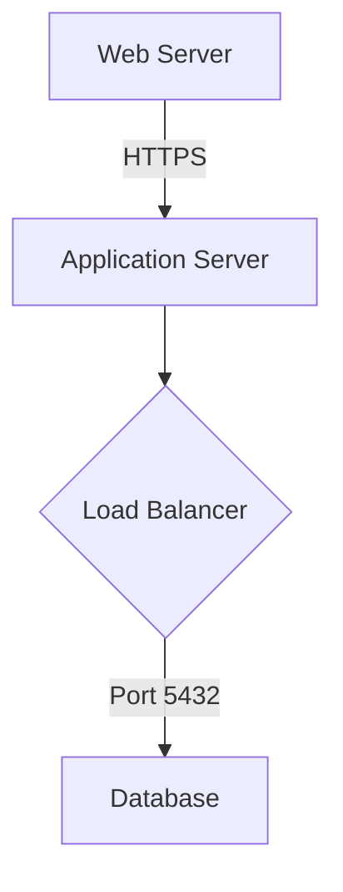
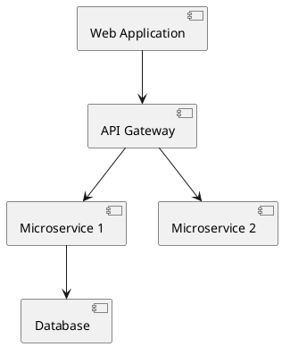
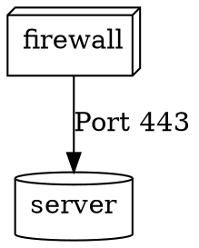

# Diagram Import Feature - Design Reference

## Overview

The Diagram Import feature in ContextCypher allows users to import diagrams from various external formats and convert them into the native security-focused diagram format. This feature bridges the gap between existing diagramming tools and ContextCypher's specialized threat modeling capabilities.

## Supported Formats

### 1. Mermaid (.mmd, .mermaid)
**Description**: Text-based diagram syntax popular for flowcharts and graphs
**Example**:


### 2. DrawIO/Diagrams.net (.drawio, .xml)
**Description**: XML-based vector diagram format
**Key Features**:
- Preserves shape styles and positions
- Supports complex layouts
- Maintains connection metadata

### 3. PlantUML (.puml, .plantuml)
**Description**: Text-based UML diagram language
**Example**:


### 4. Graphviz DOT (.dot, .gv)
**Description**: Graph description language for network diagrams
**Example**:


### 5. JSON (.json)
**Description**: Generic JSON format or ContextCypher export
**Supports**:
- Raw node/edge arrays
- ContextCypher native format
- Custom JSON structures

## Architecture

### Component Structure
```
DiagramImportDialog (UI Layer)
    ↓
DiagramImportService (Business Logic)
    ↓
Format-Specific Parsers (Parsing Layer)
    ↓
Node Type Validator (Validation Layer)
    ↓
DiagramEditor (Integration Layer)
```

### Core Classes

#### DiagramImportService
Main service orchestrating the import process.

**Key Methods**:
- `importDiagram(file: File): Promise<ImportResult>` - Main entry point
- `detectFormat(filename: string, content: string): DiagramFormat` - Format detection
- `parseContent(content: string, format: DiagramFormat): ParsedDiagram | null` - Content parsing
- `validateNodeType(type: string): string` - Node type validation
- `inferSecurityZone(node: ParsedNode): SecurityZone` - Zone assignment

#### DiagramImportDialog
UI component for file selection and import initiation.

**Features**:
- Drag & drop support
- File type filtering
- Progress indication
- Format preview

#### ImportConfirmDialog
Confirmation dialog for handling existing diagram replacement.

**Options**:
- Save current diagram
- Discard changes
- Cancel import

## Node Type Mapping

### Mapping Strategy
1. **Direct Mapping**: Known types map directly (e.g., 'firewall' → 'firewall')
2. **Pattern Matching**: Regex-based inference from labels
3. **Category Detection**: Group similar types (e.g., 'ec2', 'vm' → 'server')
4. **Fallback**: Unknown types default to 'generic'

### Supported Node Categories
- **Infrastructure** (58 types): server, router, switch, gateway, etc.
- **Security Controls** (84 types): firewall, ids, waf, siem, etc.
- **Applications** (18 types): api, database, cache, storage, etc.
- **Cloud** (11 types): cloudService, kubernetes, functionApp, etc.
- **OT/Industrial** (10 types): plc, hmi, scada, sensor, etc.
- **AI/ML** (16 types): aiModel, llmService, vectorDatabase, etc.
- **Privacy** (10 types): consentManager, gdprCompliance, etc.
- **Red Team** (10 types): c2Server, phishingServer, implant, etc.
- **SecOps** (10 types): socWorkstation, threatHunting, etc.

### Type Validation Process
```typescript
validateNodeType(type: string): string {
    // 1. Check if type exists in valid types set
    if (validNodeTypes.has(type)) return type;
    
    // 2. Try intelligent inference from label
    const inferred = inferNodeTypeFromLabel(type);
    if (validNodeTypes.has(inferred)) return inferred;
    
    // 3. Default to generic with warning
    console.warn(`Unknown node type "${type}" - defaulting to generic`);
    return 'generic';
}
```

## Security Zone Assignment

### Zone Inference Rules
Zones are automatically assigned based on:
1. **Explicit Properties**: Check node.properties.zone
2. **Name Patterns**: Match against zone keywords
3. **Node Type**: Certain types imply zones (e.g., 'firewall' → 'DMZ')
4. **Default**: Fallback to 'Internal' zone

### Zone Types
- Internet (Public-facing)
- External (Partner networks)
- DMZ (Demilitarized zone)
- Internal (Corporate network)
- Trusted (High-security)
- Restricted (Isolated)
- Critical (Mission-critical)
- Cloud (Cloud environments)
- OT (Operational Technology)

## Data Preservation

### Metadata Mapping
All node properties are preserved during import:
```typescript
// Core properties
label, description, zone, dataClassification

// Technical metadata
vendor, product, version, technology, patchLevel

// Security properties
protocols[], ports[], securityControls[], encryption

// Custom properties
All additional properties are preserved in data object
```

### Edge Properties
- Connection labels
- Protocols and ports
- Data flow direction
- Authentication methods
- Encryption status

## Layout Generation

### Algorithm
For diagrams without position data:
1. **Zone Grouping**: Group nodes by security zone
2. **Grid Layout**: Arrange nodes in grid within zones
3. **Zone Positioning**: Place zones with relationships
4. **Edge Routing**: Minimize crossing with smart routing

### Layout Parameters
- Node spacing: 200px horizontal, 150px vertical
- Zone padding: 50px
- Minimum zone size: 300x200px
- Grid columns: 5 nodes per row

## Validation and Warnings

### Import Validation
1. **Node Validation**:
   - All nodes must have unique IDs
   - Valid node types required
   - Zone assignment verification

2. **Edge Validation**:
   - Source and target must exist
   - No duplicate edges
   - Valid connection types

3. **Disconnected Nodes**:
   - Warning if >30% nodes disconnected
   - Identify orphaned components
   - Suggest connection points

### Warning System
```typescript
interface ImportWarning {
    type: 'disconnected' | 'unknown_type' | 'missing_zone';
    message: string;
    severity: 'info' | 'warning' | 'error';
    affectedItems: string[];
}
```

## User Experience

### Import Flow (Enhanced with AI)
1. **File Selection**:
   - Click import button or drag & drop
   - File type filtering (.mmd, .drawio, etc.)
   - Show all files option

2. **Format Detection**:
   - Automatic based on extension
   - Content analysis for validation
   - Preview of detected format

3. **Import Options Dialog** (New):
   - Two-tier choice: Local Processing vs AI-Enhanced
   - Local (default): Privacy-first, no data sent externally
   - AI-Enhanced: Better understanding of complex diagrams
   - Shows current AI provider (Ollama, OpenAI, etc.)
   - Optional data sanitization checkbox
   - Preview data before sending option

4. **Privacy Consent** (AI path only):
   - Clear notice about data transmission
   - Shows exactly what will be sent to AI
   - Requires explicit consent checkbox
   - Option to sanitize sensitive data
   - Collapsible privacy details

5. **Confirmation**:
   - If current diagram exists → Show save dialog
   - Options: Save, Discard, Cancel
   - Smart file handle detection

6. **Import Progress**:
   - Parsing indication (local or AI)
   - AI processing status updates
   - Validation results
   - Success confirmation

7. **Post-Import**:
   - Diagram loads with proper layout
   - Validation warnings displayed
   - Node/edge counts shown
   - AI conversion notice (if used)

### Error Handling
- **File Read Errors**: Clear error messages
- **Parse Errors**: Format-specific guidance
- **Validation Errors**: Actionable warnings
- **Type Errors**: Automatic fallback to generic

## Performance Considerations

### Optimization Strategies
1. **Streaming Parser**: For large XML files
2. **Batch Operations**: Group node/edge creation
3. **Deferred Rendering**: Load visible elements first
4. **Memory Management**: Clear intermediate objects

### Limits
- Maximum file size: 10MB
- Maximum nodes: 1000
- Maximum edges: 2000
- Timeout: 30 seconds for parsing

## Integration Points

### DiagramEditor Integration
```typescript
const handleImportDiagram = (importedDiagram: ExampleSystem) => {
    // Check for existing changes
    if (hasChanges) {
        showSaveConfirmDialog();
    } else {
        performImport(importedDiagram);
    }
};
```

### File System Access
- Uses browser File API
- Tauri file system for desktop
- Drag & drop via HTML5

### State Management
- Clear existing diagram
- Load imported nodes/edges
- Apply security zones
- Fit view to content

## AI-Enhanced Import (New Feature)

### Overview
The diagram import feature now includes an optional AI-powered conversion capability that provides better understanding of complex diagrams and more accurate mapping to ContextCypher's security-focused format.

### Key Components

#### ImportOptionsDialog
A new dialog that presents users with two import methods:
- **Local Processing** (default): Traditional pattern-based parsing
- **AI-Enhanced Processing**: Uses configured AI provider for intelligent conversion

#### Privacy-First Design
- Explicit user consent required before any data is sent to AI
- Clear privacy notices about data transmission
- Shows which AI provider will be used (Ollama, OpenAI, etc.)
- Local Ollama marked as "Local AI" for clarity
- Data preview with optional sanitization

#### Data Sanitization
When enabled, removes sensitive information:
- Company names → [Company Name]
- IP addresses → [IP Address]
- Email addresses → [Email]
- URLs → [URL]
- Instance names → [type-instance]

### AI Conversion Process

1. **Prompt Generation**: 
   - DiagramImportService builds a detailed prompt with the diagram content
   - Includes format-specific instructions
   - Requests structured JSON output

2. **API Call**:
   - Uses dedicated `/api/convert-diagram` endpoint
   - Sends format, content, prompt, and provider
   - Supports all configured AI providers

3. **Response Parsing**:
   - Extracts JSON structure from AI response
   - Validates node types against supported types
   - Maps to ContextCypher internal format

4. **Error Handling**:
   - Fallback to local parsing on AI errors
   - Clear error messages for users
   - Validation warnings for unmapped types

### Benefits of AI Enhancement
- Better understanding of diagram semantics
- More accurate security zone assignment
- Intelligent node type inference from context
- Preservation of complex relationships
- Handling of non-standard diagram formats

## Future Enhancements

### Planned Features
1. **Additional Formats**:
   - Visio (.vsdx) support
   - Lucidchart CSV import
   - AWS/Azure architecture exports
   - C4 model diagrams

2. **Advanced Mapping**:
   - Custom AI prompts for specific formats
   - Learning from user corrections
   - Template-based conversion rules

3. **Batch Import**:
   - Multiple file import with AI
   - Merge into existing diagram
   - Conflict resolution with AI suggestions

4. **Export Symmetry**:
   - Export to Mermaid
   - Export to PlantUML
   - Round-trip preservation with AI validation

### Technical Improvements
1. **Parser Enhancements**:
   - Streaming XML parser
   - Web Worker processing
   - Incremental parsing

2. **Validation**:
   - Schema validation
   - Security scanning
   - Threat detection

3. **UI Enhancements**:
   - Preview before import
   - Interactive mapping
   - Wizard-style flow

## Testing Strategy

### Unit Tests
- Parser functions for each format
- Node type validation
- Zone inference logic
- Layout generation

### Integration Tests
- End-to-end import flow
- File handling
- State management
- Error scenarios

### Test Files
Located in `/test-diagrams/`:
- `ecommerce-system.mmd` - Mermaid example
- `banking-system.puml` - PlantUML example
- `microservices.dot` - Graphviz example
- `healthcare-system.drawio` - DrawIO example
- `cloud-architecture.json` - JSON example

## Security Considerations

### Input Validation
- File size limits
- Content sanitization
- Script injection prevention
- XML entity expansion protection

### Data Privacy
- No external service calls
- Local processing only
- No telemetry on imported content
- Secure file handling

## Conclusion

The Diagram Import feature provides a comprehensive bridge between external diagramming tools and ContextCypher's security-focused architecture. With support for multiple formats, intelligent type mapping, and robust validation, it enables users to leverage existing diagrams while gaining the benefits of AI-powered threat analysis.

The feature's emphasis on data preservation, user experience, and security makes it a valuable addition to the ContextCypher toolkit, facilitating adoption and integration into existing workflows.